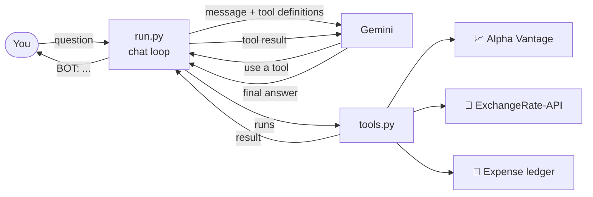

<div align="center">

# 💰 FinanceTool

**A personal finance assistant that lives in your terminal.**

Ask about stock prices, convert currencies and track your income and expenses in plain English.
BOT works out which tool to use, runs it and gives you a clear answer.


</div>

---

## ✨ What it can do

| Tool | Ask something like | What happens |
|---|---|---|
| 📈 **Stock price** | *"What's Apple trading at?"* | Gets the latest price from Alpha Vantage |
| 💱 **Currency conversion** | *"Convert 250 USD to INR"* | Uses live exchange rates from ExchangeRate-API |
| 🧾 **Expense calculator** | *"I spent 450 on food at Dominos"* | Records income and expenses by category, then shows that transaction and your remaining balance |
| 📋 **Show transactions** | *"Show all my transactions"* | Lists every recorded transaction and your current balance |

You don't need to remember any commands. Just chat, and BOT picks the right tool.

---

## 💬 Example session

```text
You: what is the price of MSFT?
[Using stock_price: {'stock_name': 'MSFT'}]
BOT: Microsoft (MSFT) is trading at $415.20.

You: I got my salary of 50000 today
[Using expense_calculator: {'action': 'income', 'amount': 50000, 'category': 'salary'}]
BOT: Added ₹50,000 salary. Your balance is ₹50,000.

You: spent 1200 on an uber ride
[Using expense_calculator: {'action': 'expense', 'amount': 1200, 'category': 'travel', 'description': 'uber ride'}]
BOT: Recorded ₹1,200 on travel. Your balance is ₹48,800.

You: show me all my transactions
[Using show_transactions: {}]
BOT: 1. Income: ₹50,000 (salary)
     2. Expense: ₹1,200 (travel, uber ride)
     Balance: ₹48,800.

You: how much is 100 euros in rupees?
[Using currency_conversion: {'amount': 100, 'from_currency': 'EUR', 'to_currency': 'INR'}]
BOT: 100 EUR is about ₹9,040.

You: stop
Bye!
```

*The numbers above are only examples.*

---

## ⚙️ How it works



1. **`tools.py`** defines each tool twice:
   - a **structure** (name, description and parameters) that tells the model what the tool does
   - a **Python function** that does the actual work
2. **`run.py`** sends your message and the tool structures to Gemini.
3. If Gemini decides a tool is needed, `run.py` runs the matching function and sends the result back.
4. Gemini turns the result into a friendly answer, which is shown as **BOT**.

---

## 🚀 Getting started

### 1. Install the dependencies

```bash
pip install -r requirements.txt
```

### 2. Get your API keys (all have free plans)

| Key | Where to get it |
|---|---|
| Gemini | [Google AI Studio](https://aistudio.google.com/apikey) |
| Stock prices | [Alpha Vantage](https://www.alphavantage.co/support/#api-key) |
| Currency rates | [ExchangeRate-API](https://www.exchangerate-api.com/) |

### 3. Create a `.env` file in the project folder

```env
G_api=your_gemini_key
Stock_api=your_alpha_vantage_key
currency_api=your_exchangerate_api_key
```

> 🔒 `.env` is listed in `.gitignore`, so your keys are never committed.

### 4. Start chatting

```bash
python run.py
```

Type **`stop`**, **`exit`** or **`quit`**, or press **Ctrl+C**, to end the chat.

---

## 🧾 Expense categories

The expense calculator only accepts set categories, so your records stay consistent.

| 💵 Income sources | 💸 Expense categories |
|---|---|
| salary · freelance · business · investment · gift · other | food · rent · travel · shopping · bills · health · entertainment · education · other |

To add your own categories, edit the `IncomeSource` and `ExpenseCategory` enums in `tools.py`.

---

## 🛡️ Built to keep going

The chat recovers from common problems instead of crashing:

- **Tool failures**, such as a network error or a bad API response, are passed to the model, which explains them in the chat.
- **API problems**, such as a wrong key, an unknown model name, rate limits or server errors, show a clear message, and you can keep chatting.
- **A missing Gemini key** is caught at startup with a helpful message.
- **Endless tool loops** are stopped after 5 rounds.
- **Ctrl+C and Ctrl+D** exit cleanly.

---

## 📁 Project structure

```text
FinanceTool/
├── tools.py      # tool structures + the functions that do the work
├── run.py        # Gemini chat loop with error handling
├── requirements.txt  # Python packages the project needs
├── .env          # your API keys (not committed)
└── readme.md
```

---

## 🔧 Configuration

| Setting | Where | Default |
|---|---|---|
| Gemini model | `MODEL` in `run.py` | `gemini-3.5-flash` |
| Max tool rounds per message | `MAX_TOOL_ROUNDS` in `run.py` | `5` |

---

## 🗺️ Roadmap

- [ ] Save expenses to a file so they persist between sessions
- [ ] Ask questions about spending, like *"how much did I spend on food this week?"*
- [ ] Date-wise expense reports
- [ ] Stock price history and charts

---

## 📌 Notes

- Expenses are kept **in memory** for now, so they reset when you close the chat.
- Free API plans have request limits. If you hit one, BOT will tell you, so wait a moment and try again.

<div align="center">

Made with ☕ and Python

</div>
