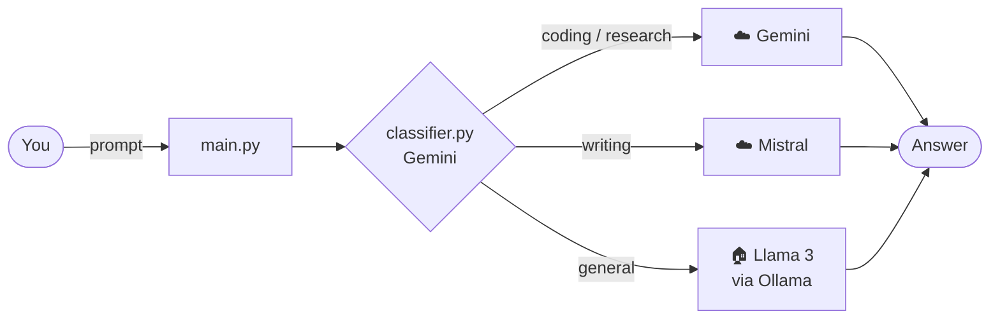

<div align="center">

# 🧭 LLM Router

**One prompt box. Three AI models. The right one for each question.**

LLM Router reads your prompt, decides what *kind* of request it is,
and sends it to the model best suited to the job: Gemini, Mistral or a local Llama.


</div>

---

## ✨ Why route?

Different models are good at different things, and they cost different amounts.
Instead of sending everything to one model, LLM Router:

- 🧠 **classifies** each prompt with a fast Gemini call
- 🎯 **routes** it to the model chosen for that category
- 🏠 **keeps everyday chat local** by sending general questions to Llama on your own machine, for free

---

## 🗺️ Routing table

| Category | Example prompt | Routed to | Where it runs |
|---|---|---|---|
| 💻 **coding** | *"Why does my Python loop never end?"* | Gemini | ☁️ Google |
| 🔬 **research** | *"Explain how mRNA vaccines work"* | Gemini | ☁️ Google |
| ✍️ **writing** | *"Write a short poem about monsoon"* | Mistral Small | ☁️ Mistral |
| 💬 **general** | *"What should I cook tonight?"* | Llama 3 8B | 🏠 Local (Ollama) |

> 😏 **Heads-up:** the Gemini provider has a personality. It answers clearly, but with a little sarcasm and attitude.

---

## ⚙️ How it works



1. **`main.py`** reads your prompt in a loop.
2. **`classifier.py`** asks Gemini to label the prompt: `coding`, `research`, `writing` or `general`.
3. **`router.py`** looks up that label and calls the matching provider.
4. The provider in **`providers/`** generates the answer. Gemini streams its reply word by word.

---

## 🚀 Getting started

### 1. Set up a virtual environment

```bash
python -m venv .venv
source .venv/bin/activate
pip install google-genai mistralai python-dotenv requests
```

### 2. Get your API keys

| Key | Where to get it |
|---|---|
| Gemini | [Google AI Studio](https://aistudio.google.com/apikey) |
| Mistral | [Mistral Console](https://console.mistral.ai/api-keys) |

### 3. Create a `.env` file

```env
Gemini_Api=your_gemini_key
Mistral_API=your_mistral_key
```

> 🔒 `.env` is listed in `.gitignore`, so your keys are never committed.

### 4. Start Llama locally with Ollama

Install [Ollama](https://ollama.com), then pull the model:

```bash
ollama pull llama3:8b-instruct-q4_0
```

Ollama runs on `http://localhost:11434`. Keep it running while you use the router.

### 5. Run it

```bash
python main.py
```

Type your prompt and press Enter. Type **`stop()`** to quit.

---

## 📁 Project structure

```text
llmrouter/
├── main.py            # prompt loop
├── classifier.py      # labels each prompt using Gemini
├── router.py          # maps a category to a provider
├── providers/
│   ├── gemini.py      # Gemini (streaming, with attitude)
│   ├── mistral.py     # Mistral Small
│   └── llama.py       # Llama 3 8B via local Ollama
└── .env               # your API keys (not committed)
```

---

## 🧩 Add your own model

Adding a model takes two steps:

**1. Create `providers/your_model.py`** with a `generate` function:

```python
def generate(prompt: str) -> str:
    # call your model here
    return answer
```

**2. Map a category to it in `router.py`:**

```python
from providers import gemini, llama, mistral, your_model

providers = {
    "coding": your_model.generate,
    ...
}
```

If you add a **new category**, also add its name to the list in the classifier prompt in `classifier.py`.

---

## 🔧 Configuration

| Setting | File | Current value |
|---|---|---|
| Classifier model | `classifier.py` | `gemini-3.6-flash` |
| Gemini answer model | `providers/gemini.py` | `gemini-3.6-flash` |
| Gemini personality | `system_instruction` in `providers/gemini.py` | clear, slightly sarcastic |
| Mistral model | `providers/mistral.py` | `mistral-small-latest` |
| Local model | `providers/llama.py` | `llama3:8b-instruct-q4_0` |

---

## 🗺️ Roadmap

- [ ] Fall back to another model if a provider is down
- [ ] Show which model answered each prompt
- [ ] Keep conversation history across prompts
- [ ] Track the cost and response time of each provider

<div align="center">

Made with ☕ and Python

</div>
